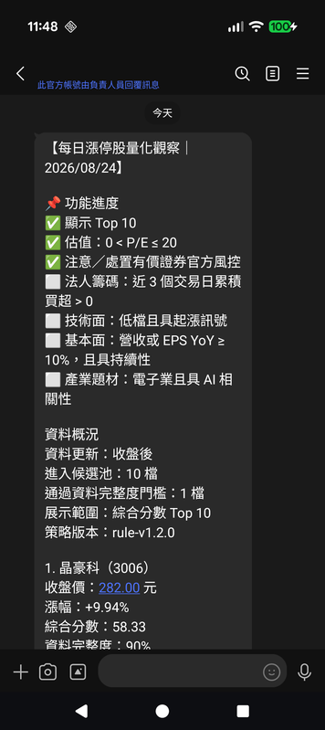

# taiwan-stock-lab-python

[](https://github.com/tenSunFree/taiwan-stock-lab-python/actions/workflows/tests.yml)
[](https://www.python.org)
[](#architecture)
[](#data-pipeline)
[](#git-workflow--cicd)
[](#delivery)
[](#testing)
[](https://coderabbit.ai)
[](#configuration)

---

## Introduction

A daily-batch quantitative research pipeline that scans Taiwan Stock
Exchange (TWSE) and Taipei Exchange (TPEx) common stocks for the day's
limit-up (漲停) closes, filters them on a hard P/E-ratio eligibility
rule, enriches the survivors with historical price, institutional-flow,
and monthly-revenue data from FinMind, filters through a configurable
risk policy, scores the remainder with a transparent multi-factor
model, renders a fixed-template research report, and delivers it to
LINE — either to a single test recipient or broadcast to every
subscriber of the Official Account. Built with a layered domain design
so that data ingestion, business rules, scoring, and delivery can each
be tested and evolved independently.

This project is for research, learning, and personal technical
practice. It is **not** investment advice, and the generated reports
are designed to say so explicitly (see [Disclaimer](#disclaimer)).

---

## Related Backend

This is currently a self-contained batch pipeline with no separate
backend service — data flows from public market data sources through
PostgreSQL and out to LINE. A dashboard/admin backend may be added in
a later phase (see [Roadmap](#roadmap)).

---

## Preview

<p align="left">
  
</p>

---

## Features

### Data Pipeline

- Trading-day determination that accounts for weekends and holidays,
  not just a Monday-Friday assumption
- Multi-source ingestion (FinMind as the primary enrichment source,
  TWSE / TPEx as the authoritative same-day close/volume/turnover
  source) behind a common `MarketDataClient` base
- Every raw API response is snapshotted before any parsing or cleaning
  happens, keyed by a fresh `ingestion_run_id` per run — reruns never
  overwrite a previous snapshot
- Source-date verification to avoid silently reusing the previous
  trading day's data (`WAITING_FOR_DATA`, not a crash, when TWSE/TPEx
  haven't published today's close yet)
- Valuation (P/E ratio) ingestion uses a different date-matching
  policy than price data: "newest available date at or before the
  target date" rather than strict same-day equality, since P/E
  depends on data (EPS, dividends) that isn't finalized as fast as a
  closing price is — bounded by a staleness ceiling so a genuinely
  stalled source is still caught, not silently accepted forever
- Official regulatory risk ingestion (attention/disposition) from
  TWSE's HTML report pages (`announcement/notice`,
  `announcement/punish`) and TPEx's JSON bulletin endpoints
  (`bulletin/attention`, `bulletin/disposal`). Each of the four
  sources (TWSE attention, TWSE disposition, TPEx attention, TPEx
  disposition) fetches and parses independently and fails
  non-fatally — a failed source leaves that market's
  `is_attention`/`is_disposition` flags `None` (unconfirmed) for every
  candidate on that market this run, never silently assumed `False`.
  TWSE's `announcement/notice` endpoint only ever reports on the
  current calendar day's query window (no historical date parameter
  is exposed), so a backfill run for a past `TARGET_TRADING_DATE`
  will correctly fail this one source rather than risk mismatching a
  different day's data
- Financial-statement (EPS) ingestion from TWSE's `t187ap06_L_ci` and
  TPEx's `t187ap06_O_ci` general-industry quarterly income-statement
  open data — see Enrichment (TWSE / TPEx Financial Statements) below
  for the full pipeline, including revision-safe availability dating
- Legally correct tick-size table and limit-up price calculation using
  `Decimal` arithmetic, verified against the official TWSE worked
  example (reference price 40.60 → limit-up price 44.65) and against a
  tick-by-tick walk-up reference implementation across every tick-size
  band boundary
- Automatic retry with exponential backoff for transient upstream read
  timeouts (confirmed via direct IP-level testing that TWSE's serving
  infrastructure has genuinely time-varying node/edge health, not a
  fixed set of broken hosts — see `market_data_client.py`'s
  `fetch_and_snapshot()` docstring)

### Candidate Pool

- Filters to active common stocks only (ETFs, ETNs, warrants, and
  depositary receipts are excluded at this layer)
- Hard exclusion on missing required fields or data-quality failures
- Minimum turnover threshold, sorted by turnover descending, capped at
  50 candidates
- Distinguishes close-limit-up (`is_close_limit_up`, used for
  selection) from intraday-touch-limit-up (`has_touched_limit_up`,
  recorded only) — a stock that opened at limit-up and was later sold
  off is not the same signal as one that closed locked at limit-up

### Valuation Eligibility

- Hard eligibility rule: `0 < P/E <= 20` (configurable via
  `MAXIMUM_PE_RATIO`), applied **before** FinMind enrichment so a
  disqualified candidate never costs an enrichment API call — this is
  an eligibility rule, not a scoring factor: a candidate either passes
  or is excluded entirely, with no partial credit
- Sourced from TWSE's `BWIBBU_ALL` and TPEx's
  `tpex_mainboard_peratio_analysis` — whole-market open-data
  snapshots, fetched the same way as daily price data
- Fail-closed on every kind of uncertainty: no valuation record for a
  stock, a missing P/E (commonly because trailing EPS is zero or
  negative), or a non-positive value are all treated as "cannot verify
  eligibility" and excluded, never assumed to pass
- A whole-market valuation source that can't be fetched, parsed, or
  that returns no data within a reasonable staleness window fails the
  entire run (`WAITING_FOR_DATA`) rather than silently publishing a
  ranking that only partially checked this rule

### Enrichment (FinMind)

- Trailing 20-day average turnover, 20-day volume ratio, and 5/20-day
  cumulative return, computed only from sessions strictly before the
  target date, plus an independent "low position + early rally"
  technical display signal (`bool | None`) computed from the same
  trailing history — see Report Rendering below
- 5-day trailing institutional net-buy ratio, reusing the same volume
  data already fetched for price-history enrichment, plus an
  independent 3-day cumulative institutional net-buy sign check
  (`bool | None`, strictly `> 0`) computed from the same fetched data
  — used purely as a report display signal (see Report Rendering
  below), never as a scoring factor, and never changing the 5-day
  ratio's own value or meaning
- Monthly revenue year-over-year, gated on FinMind's `create_time`
  field (not the calendar month alone) so a revenue figure is only
  used once its own disclosure date has actually passed — avoids
  look-ahead bias
- An independent revenue-growth-sustained display signal
  (`bool | None`): whether the latest known-available calendar
  month's YoY is `>= 10%` AND at least 2 of the trailing 3 STRICTLY
  CONSECUTIVE calendar months clear that same bar — computed from the
  same monthly-revenue points already fetched for revenue YoY above,
  never a second FinMind call. The 3-month window is built by walking
  backward one calendar month at a time from the latest available
  month (never "whichever 3 calendar months happen to have data"), so
  a gap inside the window (a missing calendar month) is never silently
  bridged by an older month — it makes the whole signal `None` rather
  than a partial-window guess
- Each enrichment type (price history, institutional flow, monthly
  revenue) fails **independently**: one FinMind endpoint being briefly
  unavailable never clears factors already computed from another
  successful fetch for the same stock

### Enrichment (TWSE / TPEx Financial Statements — EPS)

- A separate, dedicated ingestion path from FinMind's enrichment
  above: TWSE's `t187ap06_L_ci` (JSON) and TPEx's `t187ap06_O_ci`
  (CSV) general-industry quarterly comprehensive-income-statement open
  data, fetched once for the WHOLE market per run (same tier as the
  TWSE/TPEx price/valuation/regulatory snapshots), not per-candidate —
  neither endpoint has FinMind's per-stock rate limit, so there's no
  reason to repeat the call for every candidate
- TWSE/TPEx report cumulative (year-to-date) EPS per quarter, not
  standalone per-quarter figures — verified directly against real
  台泥/1101 data. A dedicated converter reconstructs genuine
  standalone quarterly EPS (`Q2 = H1 cumulative − Q1 cumulative`, etc.)
  before any YoY comparison is made
- A revision-safe, append-only observation table
  (`eps_cumulative_observations`) records the first calendar date this
  pipeline itself ever observed each distinct `(stock_id, fiscal_year,
  quarter, cumulative_eps)` VALUE — keying on the value itself, not
  just the period, so a later restatement (TWSE revising a prior
  quarter's EPS) gets its own new `first_seen_at` rather than
  inheriting the original disclosure's date, which would otherwise
  reintroduce look-ahead bias for a figure the market didn't actually
  know at the time. When `DATABASE_URL` isn't configured for a given
  run, this degrades gracefully to the dataset's own `出表日期` (batch
  report date) — a real, observed date, never a synthetic one — rather
  than failing the run
- An independent EPS-growth-sustained display signal (`bool | None`),
  the direct sibling of the revenue-growth-sustained signal above:
  whether standalone quarterly EPS YoY has cleared `>= 10%` and been
  sustained across the required trailing quarters. Kept as its own
  field end-to-end (never pre-combined with the revenue signal in
  `StockFeatures` or `ReportStockView`) — the "revenue OR EPS"
  combination is computed on demand at the report-rendering layer
  instead, so a reader can always see which component actually drove
  the combined result (see Report Rendering below)
- Fails non-fatally at the whole-market level, same policy as the
  regulatory (attention/disposition) sources above: a fetch/parse
  failure on either TWSE's or TPEx's endpoint simply leaves that
  market's candidates with `eps_growth_sustained = None` for the run,
  never silently treated as "confirmed not sustained"

### Risk Policy

- Official attention/disposition/managed status is tri-state
  (`bool | None`) and, as of `rule-v1.2.0`, defaults to **allowed but
  flagged** rather than hard exclusion: a disposition or
  managed/full-cash-delivery stock still reaches scoring and the
  report with a `DISPOSITION_STOCK`/`MANAGED_STOCK` flag, instead of
  silently vanishing from the candidate pool with no explanation.
  This is a more serious official signal than an attention stock, but
  hard exclusion is deliberately deferred until the flag has been
  observed and backtested — display the official status honestly
  first, decide whether to actually exclude later. Each is
  independently configurable back to hard exclusion via
  `RiskPolicyConfig.allow_disposition_stock` /
  `allow_managed_stock` (and the pre-existing
  `allow_attention_stock`)
- Score penalties for `ATTENTION_STOCK`/`DISPOSITION_STOCK`/
  `MANAGED_STOCK` are `0.0` (display-only) in `rule-v1.2.0` — flagging
  a stock never changes its `risk_quality` score yet, only what's
  shown in the report. `RISK_FLAG_PENALTIES` is the single place to
  change once backtesting justifies a real penalty for any of the
  three
- Soft risk flags that were already display-only before this change
  (KY stock, one-price limit-up, excessive consecutive limit-up days,
  elevated 5-day return) are unaffected
- Tri-state inputs (`bool | None`, not `bool`): `None` means "no data
  source has confirmed this status yet," and is never silently
  coerced into `False`/"confirmed clean" — an unconfirmed input is
  tracked in `missing_inputs` and disqualifies that stock's
  `risk_quality_raw` from being scored as if it were verified. A
  source failure for attention/disposition data (see Data Pipeline
  above) is exactly this case: it leaves the affected market's
  candidates with `None`, not `False`
- `RiskAssessment.missing_inputs` is carried all the way through
  `StockFeatures.risk_missing_inputs` → `ScoredStock.risk_missing_inputs`
  → the rendered report, so the reader-facing text can explain
  *which* specific inputs are still unconfirmed for a given stock
  (e.g. "全額交割／變更交易方法狀態、連續漲停天數尚未確認"), not just
  that `risk_quality` couldn't be scored — see Report Rendering below
- Every threshold lives in a versioned `RiskPolicyConfig`
  (`config/strategy-v1.yaml`) rather than being hardcoded

### Multi-Factor Scoring

- Six transparent, equally-documented factors: liquidity, volume/price
  structure, momentum, institutional flow, fundamentals, and risk
  quality
- Cross-sectional percentile normalization (Winsorized 5%-95%) so
  factors on different units and scales become comparable
- A dedicated non-monotonic momentum scoring function — an already
  extended rally is treated as elevated chase-in risk, not as an
  automatically higher score
- Missing factors are never backfilled with a neutral score; the total
  score is renormalized over the factors that are actually available,
  and `data_completeness` is recorded per stock
- Stocks below the minimum data-completeness threshold are ineligible
  for the published ranking (Top N, configurable via `RANKING_LIMIT`),
  regardless of score

### Report Rendering

- Fixed-template renderer (no LLM) producing LINE-compatible text,
  with explicit counts distinguishing "entered the candidate pool"
  from "cleared the completeness gate" — no field is named in a way
  that overstates what it actually measures
- Each stock's per-line "今日排名：N / M" denominator (`M`) is the
  number of stocks ACTUALLY appearing in today's report
  (`len(ranked_stocks)`), not the configured `ranking_limit` ("Top N"
  display cap) — the two legitimately differ whenever fewer stocks
  clear the completeness gate than `ranking_limit` allows for (e.g.
  only 5 stocks qualified even though `ranking_limit` is 10); showing
  "1 / 10" next to a 5-stock list would read as a contradiction, since
  there's no stock ranked 6th–10th anywhere in the report to justify
  that denominator. The "顯示 Top N" checklist line and "展示範圍：
  綜合分數 Top N" line are unaffected by this and still describe the
  configured cap itself
- Each stock's block shows a **signal-light summary** (🟢 strong /
  🟡 moderate / 🔴 weak / ⚪ insufficient data) for all six scoring
  factors — including `volume_price`, which an earlier template
  version never surfaced on its own — so a reader can scan relative
  strength across every factor at a glance, not just the top 1-2
  highest-scoring names
- A **tri-state regulatory status display** (`✅` confirmed clean /
  `⚠️`/`🚨` flagged / `⚪` unconfirmed) for attention, disposition, and
  managed status, shown individually rather than folded into a single
  risk-flag bullet list. An officially-confirmed-clean `False` and a
  genuinely-unknown `None` (e.g. because that market's regulatory
  source failed to fetch this run) are never rendered as the same
  thing — this is the report-facing expression of the tri-state
  design in Risk Policy above
- As of `text-v7`, attention is labeled "今日公布注意" (announced
  TODAY) and disposition is labeled "目前處置" (currently ACTIVE) —
  reflecting the genuinely different time semantics of the two
  official datasets: attention is matched by an EXACT announcement
  date (see `twse_regulatory_mapper.build_twse_attention_statuses`'s
  own docstring — a per-day announcement, not a persistent state),
  while disposition is matched by an ACTIVE PERIOD (start <=
  target_date <= end). The two can legitimately disagree — e.g. "今日
  公布注意：否" alongside "🚨 目前處置：是" — without that being a
  contradiction, since they answer different-shaped questions on
  different time axes. A flagged disposition entry also closes with
  "處置措施：請依交易所該次公告為準" — concrete trading measures
  (matching mechanism, credit-trading restrictions, advance-deposit
  requirements) are deliberately never hardcoded here, since they vary
  by announcement round and by the exchange's own rule revisions
- The momentum signal renders "漲多過熱" instead of a generic "偏弱"
  specifically when `HIGH_FIVE_DAY_RETURN` is also raised, since
  `bounded_momentum_score` is intentionally non-monotonic (an
  already-extended rally is penalized, not rewarded) — a low momentum
  score can therefore mean either genuinely weak recent momentum or an
  overheated rally, and the generic wording collapsed both into a
  potentially misleading label. This is a display-only distinction:
  `HIGH_FIVE_DAY_RETURN` is reused purely as a report-level hint, and
  `rule-v1.2.0`'s `FACTOR_WEIGHTS` and scoring logic are unchanged
- As of `text-v8`, a **法人籌碼 (institutional net-buy) tri-state
  section** shows whether cumulative institutional net-buy over the
  trailing 3 sessions is strictly positive (`✅` yes / `❌` no / `⚪`
  insufficient data). This is a display signal independent of the
  "institutional" scoring factor already shown in the signal-light
  summary above — a different window (3 sessions vs. 5) and a
  different calculation (a plain sign check vs. a normalized
  net-buy/volume ratio) — so the two can legitimately show different
  results for the same stock without that being a contradiction, and
  are never conflated or allowed to influence one another
- As of `text-v9`, a **技術面 (low-position + early-rally) tri-state
  section** shows whether today's close is both (a) within the bottom
  30% of its own trailing 20-session closing-price range and (b) just
  crossed above its own 5-session moving average today — a bullish
  crossover check (previous close at/below its MA5, today's close
  above today's MA5), not a "currently sitting above MA5" snapshot, so
  a stock that has been strong for weeks doesn't get relabeled as
  "just starting to rise." This is a display signal independent of
  the "momentum" scoring factor already shown in the signal-light
  summary above — a completely different calculation (a price-range
  position plus a moving-average crossover, vs. 5-day/20-day
  cumulative returns) — so the two can legitimately disagree for the
  same stock without that being a contradiction
- As of `text-v10`, a **基本面 (revenue-growth-sustained) tri-state
  section** shows whether monthly revenue YoY growth has been
  sustained over the trailing 3 known-available calendar months (`✅`
  yes / `❌` no / `⚪` insufficient data). This is a display signal
  independent of the "fundamental" scoring factor already shown in
  the signal-light summary above — that factor is built from a single
  newest-month YoY value, while this signal requires persistence
  (latest month `>= 10%` AND at least 2 of the trailing 3 strictly
  consecutive calendar months `>= 10%`) — so the two can legitimately
  disagree for the same stock (e.g. a strong single-month YoY that
  hasn't yet been sustained, or vice versa) without that being a
  contradiction
- As of `text-v11`, the 基本面 section's headline answers the
  ORIGINALLY intended question — "has revenue OR EPS YoY growth of
  `>= 10%` been sustained" — combined via a tri-state OR at render
  time from the independent revenue and EPS signals above (`✅` yes /
  `❌` no, only when BOTH components are confirmed `False` / `⚪`
  unconfirmed, if either component is still unknown and neither is
  confirmed `True`). The two underlying components are still shown as
  their own sub-lines beneath the combined headline, so a reader can
  see exactly whether revenue, EPS, or both actually drove the
  result — the combination never erases that distinction the moment
  either component becomes `True`
- A **漲停結構 (limit-up structure)** section combining
  `is_one_price_limit_up` and the 20-day volume ratio; a missing
  volume ratio is rendered as an explicit "資料不足," never silently
  omitted
- The "資料缺口" line explaining why `risk_quality` couldn't be scored
  is built **dynamically** from the stock's actual
  `risk_missing_inputs`, rather than a single fixed sentence — this
  replaced an earlier bug where the sentence kept saying
  "attention/disposition not yet wired in" even after those two
  sources were actually wired in and healthy
- Attention/disposition flags render with their official reason text
  and, for disposition, the active period (e.g. `2026/08/24 ~
  2026/08/28`) — not just the bare flag name — so the reader sees
  *why* a stock is flagged, not only that it is. The full legal-text
  description (`disposition_measure`, which can run several hundred
  characters in real TWSE/TPEx responses) is deliberately never
  reproduced in the report, to stay within LINE's message length
  budget; the reader is pointed to the official announcement instead
- Always renders a report even when zero stocks qualify, rather than
  silently sending nothing — the reader can confirm the pipeline ran
  normally
- Enforces LINE's 5000-UTF-16-unit text message limit at render time
- `REPORT_DRY_RUN=true` prints the exact report text to stdout for
  manual inspection, with no LINE call and no database write

### Delivery

- `LINE_DELIVERY_MODE` selects one of three modes: `off` (default, no
  side effect), `push` (send to a single `LINE_TARGET_ID` — for
  testing a report-format change without notifying every subscriber),
  or `broadcast` (send to every friend of the Official Account — the
  real daily delivery to subscribers)
- Report content is deterministic for a given trading date/strategy
  version (no wall-clock timestamp embedded in it), which is what
  makes database-level idempotency actually hold across reruns
- The report FORMAT itself is separately versioned via
  `MESSAGE_VERSION` (currently `text-v11`) — bumped whenever the
  rendered template's shape or line semantics change, independent of
  `STRATEGY_VERSION`'s scoring-logic versioning, so a format-only
  change and a scoring-only change can each be tracked and
  idempotency-keyed without conflating the two
- Two intentionally separate idempotency mechanisms:
  a SHA-256 **database idempotency key** (trading date + strategy
  version + delivery target/scope + message version) for
  duplicate-delivery detection, and a UUID **`X-Line-Retry-Key`** per
  HTTP send attempt for safely retrying a single in-flight call
  without LINE processing it twice
- Push and Broadcast share one retry/409/4xx/5xx implementation in the
  LINE client, and one reserve→send→mark-success/failed orchestration
  in `DeliveryService`, so a future change to that logic can't
  silently apply to one send mode and not the other
- Broadcast has no single LINE target to hash into the idempotency key
  the way Push does; it reuses the same mechanism with a fixed logical
  scope label instead of changing the database schema — verified
  end-to-end against the real LINE API: first run → `SUCCESS`, rerun
  minutes later → `SKIPPED_ALREADY_SENT` with no second HTTP call

---

## Roadmap

- **Phase 6** — Multi-recipient subscriber management: today's
  Broadcast mode sends to every current friend of the Official
  Account, which is intentionally simple for a small family/friend
  audience. If audience segmentation is ever needed (e.g. different
  content per subscriber tier), that requires a webhook receiver plus
  a subscriber table and would move to LINE's Multicast API instead.
- **Phase 7** — Performance tracking: T+1 / T+5 / T+20 returns, a fill
  simulation model that distinguishes signal return from assumed-fill
  return, and transaction cost modeling. The report already carries a
  placeholder note ("歷史分位及 T+1／T+5 統計尚未納入目前版本") so
  readers aren't left guessing why these numbers don't appear yet.
- **Phase 8** — LLM-assisted report writing on top of the existing
  rule-based renderer, with strict JSON-schema validation and
  automatic fallback to the fixed template on any validation failure
- **Phase 9** — Productionization: real database migrations (Alembic
  is already a dependency but no migration workflow is wired in yet —
  schema changes currently go through a `checkfirst=True` bootstrap
  meant only for local/manual validation), Cloud Scheduler + Cloud Run
  Job as an alternative to GitHub Actions scheduling, and an optional
  web dashboard for historical ranking queries
- **Known data gaps** — `is_managed` (full-cash-delivery status) still
  has no wired-in official data source and remains `None` for every
  stock; `RiskPolicy.assess()` still accepts it as a parameter, it's
  just never supplied a non-`None` value yet. `is_attention` /
  `is_disposition` are now wired to TWSE's `announcement/notice` /
  `announcement/punish` and TPEx's `bulletin/attention` /
  `bulletin/disposal` endpoints (see Data Pipeline above) — a
  per-source fetch/parse failure leaves that market's flags `None`
  (unconfirmed) for the run, never silently coerced to `False`.
  `consecutive_limit_up_days` still has no reliable historical
  reference-price source and is not reconstructed from raw closing
  prices, since doing so would violate this project's own rule
  against inferring limit-up status via "previous close × 1.10."
  EPS/financial-statement data is now ingested (TWSE's `t187ap06_L_ci`
  + TPEx's `t187ap06_O_ci` — see Enrichment above), so the report's
    基本面 section now answers the originally intended "revenue OR EPS"
    condition rather than revenue alone. The revision-safe
    `eps_cumulative_observations` table this relies on for a precise
    `first_seen_at` is optional at runtime, not a hard requirement: when
    `DATABASE_URL` isn't configured, the pipeline still computes
    `eps_growth_sustained` correctly, just with coarser (dataset-batch-
    level rather than first-truly-observed) availability dating — see
    Enrichment above. All remaining gaps are logged as an explicit
    warning on every run rather than silently assumed fixed, and are
    reflected per-stock in the report's dynamic "資料缺口" line (see
    Report Rendering above).

---

## Disclaimer

Every generated report includes, verbatim:

> 本清單依公開市場資料及固定量化規則產生，僅供研究與資料整理，不構成買進、賣出或持有建議。
>
> ("This list is generated from public market data and fixed
> quantitative rules. It is for research and data organization
> purposes only and does not constitute a recommendation to buy, sell,
> or hold any security.")

Promotional or advisory language ("必買/must buy," "明牌/hot tip,"
"保證獲利/guaranteed profit," "最佳買點/best pick") is explicitly
excluded and covered by tests (`tests/test_text_renderer.py`).

---

## Tech Stack

- **Python 3.12** — `dataclasses`, `Protocol`, and `StrEnum` used
  throughout to keep domain models explicit and dependency-light
- **Decimal** — all price, tick-size, and P/E-ratio arithmetic uses
  `Decimal`, never `float`, to avoid floating-point rounding errors in
  financial comparisons
- **pandas** — cross-sectional percentile normalization for
  multi-factor scoring
- **httpx** — HTTP client for market-data ingestion and the LINE
  Messaging API client; tested via `httpx.MockTransport` without any
  real network call
- **Hand-rolled retry loop** (no external retry library) for both
  market-data fetches and LINE sends — deliberately explicit so a
  LINE `X-Line-Retry-Key` can be pinned once, outside the loop, and
  reused across every attempt inside it; see `market_data_client.py`
  and `line_client.py`
- **SQLAlchemy** — ORM models for raw source payload snapshots and
  message delivery idempotency tracking
- **truststore** — routes TLS certificate verification through the
  OS trust store, working around a Python 3.13 + OpenSSL 3.5.x
  certificate-chain-validation issue observed when connecting to TPEx
- **PyYAML** — versioned strategy configuration (`config/strategy-v1.yaml`)
- **pytest** — unit and integration tests across data ingestion, risk
  policy, scoring, report rendering, and LINE delivery (push +
  broadcast)
- **GitHub Actions** — scheduled daily job with `concurrency` guards
  and manual `workflow_dispatch` trigger for backfilling a specific
  trading date or testing in dry-run mode

---

## Environment

- Python: `3.12+`
- PostgreSQL: for delivery idempotency tracking (`message_deliveries`
  table). **Must be an externally reachable, persistent database** —
  not a local SQLite file — for any scheduled/CI environment, since
  GitHub Actions runners are ephemeral and a fresh SQLite file every
  run would defeat idempotency entirely. SQLite is fine for local
  manual testing only.

## Local Development

```bash
python -m venv .venv
source .venv/bin/activate      # Windows: .venv\Scripts\activate

pip install -r requirements.txt
```

### Useful commands

```bash
pytest -v                          # run the full test suite
pytest -x --tb=short               # fail fast, short traceback (mirrors CI)
python -m app.jobs.daily_ranking   # run the pipeline locally
```

### Configuration

Strategy thresholds and factor weights are centralized in
`config/strategy-v1.yaml` and never hardcoded into domain logic.
When tuning thresholds after backtesting, create a new
`strategy_version` (e.g. `rule-v1.2.0`) rather than overwriting the
existing file, so historical ranking results keep a stable reference
baseline.

Environment variables consumed by the job (see
`.github/workflows/daily-limit-up-ranking.yml`):

| Variable                    | Purpose                                                                                      |
|-----------------------------|------------------------------------------------------------------------------------------------|
| `FINMIND_TOKEN`             | FinMind API token                                                                            |
| `DATABASE_URL`              | PostgreSQL connection string (delivery idempotency tracking)                                 |
| `TARGET_TRADING_DATE`       | Manual override for `workflow_dispatch` backfills; defaults to today                         |
| `REPORT_DRY_RUN`            | `true` → render and print the report to stdout only; no LINE call, no DB write               |
| `LINE_DELIVERY_MODE`        | `off` (default) / `push` (single target) / `broadcast` (all OA friends)                      |
| `LINE_CHANNEL_ACCESS_TOKEN` | Required when `LINE_DELIVERY_MODE` is `push` or `broadcast`                                  |
| `LINE_TARGET_ID`            | Required only when `LINE_DELIVERY_MODE=push` — the single LINE user/group/room to deliver to |

> **Note:** TWSE's `announcement/notice` (attention) endpoint only
> ever reports the current calendar day's data — it has no verified
> historical date-query parameter. A `TARGET_TRADING_DATE` backfill
> for a date other than today will correctly fail this one source
> (logged, non-fatal) rather than risk mismatching a different day's
> attention list; the rest of the pipeline still completes normally.

---

## Testing

```bash
pytest -v
```

- Unit tests for tick-size bands, the official TWSE limit-up worked
  example, and a tick-by-tick walk-up reference implementation used to
  regression-test every tick-size boundary crossing
- Candidate-pool tests covering instrument-type exclusion, minimum
  turnover exclusion, sort-and-cap-at-50 behavior, and non-limit-up
  exclusion
- Valuation-filter and valuation-mapper tests covering the full
  `0 < P/E <= 20` boundary table, fail-closed handling of missing or
  invalid P/E, and the look-ahead-safe "newest available date at or
  before target" date-matching policy (including the staleness ceiling
  that catches a genuinely stalled valuation source)
- Enrichment tests covering independent fail-soft behavior across
  price-history, institutional-flow, and monthly-revenue fetches, a
  look-ahead-bias regression test for revenue YoY (a figure is only
  usable once its own disclosure date has passed, not just once its
  calendar month has), dedicated tests for the 3-day institutional
  net-buy sign check (`build_institutional_net_buy_positive`)
  confirming it uses a strict `> 0` comparison, returns `None` rather
  than a partial answer when any required session lacks data, and can
  legitimately disagree with the 5-day scoring ratio for the same
  stock without that being a bug, and dedicated tests for the
  low-position/early-rally technical signal
  (`build_low_with_rising_signal`) confirming the 20-session range
  position and the 5-day moving-average crossover are each evaluated
  independently, that a stock already sitting above its MA5 for a
  while is correctly distinguished from one just crossing above it
  today, and that a degenerate flat trading range never triggers a
  division-by-zero
- Revenue-growth-sustained signal tests
  (`build_revenue_growth_sustained_signal`) confirming the 3-month
  window is built from STRICTLY CONSECUTIVE calendar months walking
  backward from the latest available month — never "whichever 3
  months happen to have data" — including a dedicated regression test
  for a gap month inside the window (a missing calendar month must
  not be silently bridged by an older month, which would otherwise
  produce a false "sustained" reading) and a calendar year-boundary
  test (December → January rollover). Also covered: the requirement
  that the LATEST month individually clear the threshold even when
  older months in the window pass, a single soft (non-passing) month
  elsewhere in the window not by itself breaking an otherwise-
  sustained trend, and the same no-look-ahead / no-best-effort
  philosophy as `build_revenue_yoy` — any single unresolvable required
  month (missing current-side point, or missing/non-positive
  previous-year denominator) makes the whole signal `None` rather than
  a partial-window guess
- EPS pipeline tests spanning every layer independently plus one
  end-to-end integration test: `financial_statement_client.py`'s TWSE
  JSON / TPEx CSV fetch and parse (including a real-shaped BOM-prefixed
  TPEx CSV response, to catch a BOM leaking into the first header's
  key and silently making every row look like it's missing that
  field), `eps_mapper.py`'s row-dropping rules, `eps_period_converter.py`'s
  cumulative-to-standalone conversion, `eps_growth_builder.py`'s YoY
  and sustained-growth threshold/window logic and its revenue-OR-EPS
  tri-state combiner's full truth table, `eps_observation_repository.py`'s
  revision-safety guarantee (a restated value gets a new row and a new
  `first_seen_at`; re-observing an unchanged value never overwrites the
  original `first_seen_at`, proven with a case where naive `float`
  comparison would otherwise wrongly treat two textually-identical
  figures as different due to binary floating-point noise), and one
  full `daily_ranking.run()` integration test that feeds a real
  TWSE `t187ap06_L_ci`-shaped JSON response all the way through to the
  actual rendered report text — not just verified piecewise the way
  each layer's own unit tests do it
- Regulatory-mapper tests (TWSE HTML via `twse_regulatory_mapper.py`,
  TPEx JSON via `regulatory_mapper.py`) covering exact-announcement-date
  matching for attention data vs active-period matching for
  disposition data, title/date-range validation that raises rather
  than silently trusting a wrong-day or malformed response, and an
  end-to-end regression proving a real attention/disposition hit flows
  all the way from the raw fetch through to the rendered report text
- Risk-policy tests covering tri-state input handling (an unconfirmed
  status is never scored as if it were confirmed clean), the
  `rule-v1.2.0` allowed-but-flagged default for disposition/managed
  stocks alongside the still-available hard-exclusion configuration,
  and threshold-driven soft flags
- Scoring tests covering factor-weight integrity, liquidity ordering,
  missing-factor renormalization (never backfilled with a neutral
  score), and Top-N selection under a data-completeness floor
- Signal-light and tri-state regulatory-status renderer tests covering
  all six factors' emoji/word mapping (including the "unconfirmed ≠
  confirmed clean" distinction for attention/disposition/managed), a
  dynamic-missing-reason regression test guarding against the old
  stale-hardcoded-sentence bug recurring once a previously-unwired
  input gets wired in, attention-vs-disposition time-semantics
  regression tests confirming the two can disagree without being a
  contradiction, a momentum-overheating regression test confirming a
  low momentum score paired with `HIGH_FIVE_DAY_RETURN` renders "漲多
  過熱" rather than the generic "weak" label, a 法人籌碼 tri-state
  rendering test confirming it stays independent of the
  "institutional" signal-light score for the same stock, a 技術面
  tri-state rendering test confirming it stays independent of the
  "momentum" signal-light score for the same stock, and a 基本面
  tri-state rendering test confirming it stays independent of the
  "fundamental" signal-light score for the same stock, dedicated tests
  for the revenue-OR-EPS combined headline's tri-state-OR truth table
  (including the case where one component is confirmed `False` and the
  other is still unknown — the combined result must stay unconfirmed,
  never prematurely resolve to "否" just because one side already has
  an answer), and a progress-checklist regression test confirming the
  "基本面" line correctly flips from ⬜ to ✅ with wording that no
  longer claims EPS isn't wired in
- Report-renderer tests asserting the disclaimer is always present,
  that promotional language never appears in output, that
  candidate/eligible counts are labeled accurately, that a
  disposition stock's rendered period/reason never leaks the full
  legal-text description, and a regression test confirming each
  stock's "今日排名" denominator matches the actual number of stocks
  listed that day rather than the configured `ranking_limit` (while
  the "顯示 Top N" / "展示範圍" lines still correctly reflect
  `ranking_limit` itself)
- LINE client tests using `httpx.MockTransport` to simulate 200 / 409
  / 429 / 500 responses for both Push and Broadcast endpoints,
  verifying retry-key propagation, duplicate handling, and
  retry/backoff behavior — no real token required
- Delivery-service and end-to-end `daily_ranking.run()` tests covering
  first-send/rerun idempotency for both Push and Broadcast, confirming
  they're tracked as independent deliveries, and a direct regression
  test asserting report content stays byte-identical across a real
  wall-clock time gap (a prerequisite for delivery idempotency to hold
  at all)

See the badge at the top of this file for current test status.

---

## Architecture

Clean separation between data ingestion, domain rules, report
rendering, and delivery:

```
app/domain/          Pure business logic — no I/O, no framework dependency
  price_ticks.py         Tick-size table + limit-up price calculation
  limit_up.py             Close-limit-up vs touched-limit-up detection
  models.py                StockMaster / DailyPrice / StockValuation /
                            RegulatoryRiskStatus, decoupled from any
                            data source
  features.py               StockFeatures, including risk_missing_inputs
                            (carried through from RiskAssessment),
                            institutional_net_buy_3d_positive,
                            technical_low_with_rising_signal,
                            fundamental_growth_sustained (revenue-only),
                            and eps_growth_sustained (its independent
                            EPS sibling — all display-only)
  candidate_builder.py     Common-stock filtering + turnover ranking
  valuation_filter.py       P/E ratio hard eligibility filter (0 < P/E <= 20)
  feature_builder.py        Trailing price-history factor computation
  technical_signal_builder.py
                             Low-position (20-session range) + early-rally
                             (5-session MA crossover) display signal —
                             look-ahead-safe, not a scoring factor
  institutional_flow_builder.py
                             Institutional net-buy ratio (5-day, scoring
                             factor) and net-buy positive sign check
                             (3-day, display-only) — both look-ahead-safe
  monthly_revenue_builder.py
                             Revenue YoY (look-ahead-safe via available_at,
                             scoring factor) and an independent
                             revenue-growth-sustained display signal
                             (latest month >= 10% AND at least 2 of the
                             trailing 3 STRICTLY CONSECUTIVE calendar
                             months >= 10%; a gap month inside the window
                             is never bridged by an older month) — both
                             computed from the same fetched monthly-
                             revenue points, no second API call
  risk_inputs.py             Reliable/heuristic RiskPolicy input reconstruction
  risk_policy.py              Tri-state hard exclusion + soft risk flagging,
                              configurable allow/exclude per official flag
  scoring.py / normalization.py
                             Multi-factor scoring, Top-N selection, and
                             risk_missing_inputs propagation to ScoredStock
  eps_growth_builder.py       Standalone quarterly EPS YoY + sustained-growth
                            signal, and the revenue-OR-EPS tri-state OR
                            combiner used at the report-rendering layer

app/ingestion/        Data source integration
  trading_calendar.py     Trading-day checks
  market_data_client.py    Raw-snapshot-first ingestion clients with retry,
                            including TWSE/TPEx attention + disposition fetches
  financial_statement_client.py
                             Unified TWSE (t187ap06_L_ci JSON) / TPEx
                            (t187ap06_O_ci CSV) financial-statement fetch
                            client + row parsers, feeding the EPS pipeline
  finmind_mapper.py / twse_mapper.py / tpex_mapper.py
                             Provider-specific row parsing
  valuation_mapper.py       TWSE/TPEx P/E ratio row parsing
  regulatory_mapper.py       TPEx attention/disposition JSON parsing
  twse_regulatory_mapper.py  TWSE attention/disposition HTML parsing
  eps_mapper.py               Raw cumulative-EPS row parsing (TWSE/TPEx
                            general-industry income-statement rows)
  eps_availability_resolver.py
                             Resolves each EPS point's look-ahead-safe
                            available_at: first_seen_at (from the revision-
                            safe observation DB) when known, else the
                            dataset's own batch report date
  eps_period_converter.py    Converts cumulative (year-to-date) EPS into
                            genuine standalone per-quarter EPS

app/reports/           Report rendering
  report_builder.py         ScoredStock + StockFeatures -> ReportStockView
                            adaptation, merging in official regulatory detail,
                            factor_scores, volume_ratio_20d,
                            institutional_net_buy_3d_positive,
                            technical_low_with_rising_signal,
                            fundamental_growth_sustained,
                            eps_growth_sustained, and risk_missing_inputs —
                            revenue and EPS are passed through as their OWN
                            independent fields, never pre-combined here
  text_renderer.py            Fixed-template LINE-compatible text output:
                            per-factor signal lights (with a momentum-
                            overheating override), tri-state regulatory
                            status with distinct per-day-announcement vs
                            active-period wording, a 法人籌碼 tri-state
                            institutional net-buy display, a 技術面
                            tri-state low-position/early-rally display, a
                            基本面 section combining revenue and EPS
                            growth-sustained via a tri-state OR at render
                            time (with both components still shown as
                            sub-lines), limit-up structure, and a
                            dynamically built risk_quality gap explanation

app/clients/           External API clients
  line_client.py             LINE Messaging API push/broadcast client
  idempotency.py              Idempotency key + retry key derivation

app/delivery/          Delivery orchestration
  service.py                 Reserve -> send -> mark-success/failed, for both Push and Broadcast

app/db/                SQLAlchemy ORM models
  models.py                    IngestionRun, RawSourcePayloadRow,
                            MessageDelivery, and the revision-safe
                            EpsCumulativeObservation table (unique on
                            stock_id + fiscal_year + quarter +
                            cumulative_eps, so a restated figure gets its
                            own row and its own first_seen_at rather than
                            overwriting the original disclosure's)
  delivery_repository.py     Delivery idempotency persistence
  eps_observation_repository.py
                             Revision-safe first_seen_at read/write —
                            observe() never overwrites an existing row's
                            first_seen_at once a given EPS value has been
                            recorded once, the same crash/concurrency-safe
                            "insert, catch the UNIQUE-constraint conflict,
                            return the existing row" pattern as
                            delivery_repository.py

app/jobs/              Scheduled job entry points
  daily_ranking.py            Full pipeline orchestration
```

---

## Git Workflow & CI/CD

- Feature-branch workflow: one branch per unit of work, merged into
  `main` via Pull Request once its test suite is green
- Commit messages follow a structured, scope-prefixed summary format
  (`feat:`, `fix:`, `chore:`) so `git log` doubles as a changelog
- Two GitHub Actions workflows:
  - `tests.yml` — runs the full test suite on every push/PR, no
    external credentials required; this is what the Tests badge above
    reflects
  - `daily-limit-up-ranking.yml` — runs the full pipeline on a
    three-attempt schedule (16:17 / 16:47 / 17:17 Taiwan time) with a
    `concurrency` group to prevent overlapping runs, plus a
    `workflow_dispatch` input for manually backfilling a specific
    trading date or testing in dry-run mode before going live
- Automated AI-assisted code review via CodeRabbit on every Pull
  Request to identify potential bugs, security concerns,
  maintainability issues, and consistency violations before merging
- Secrets (`FINMIND_TOKEN`, `DATABASE_URL`, `LINE_CHANNEL_ACCESS_TOKEN`,
  `LINE_TARGET_ID`) are injected via GitHub Actions secrets and never
  committed to the repository

---

## Project Structure

> High-level overview, not an exhaustive file listing.

```
taiwan-stock-lab-python
├─ app
│  ├─ domain              # Pure business logic (see Architecture above)
│  ├─ ingestion             # Market data providers and raw snapshot clients
│  ├─ reports                # Report rendering
│  ├─ clients                # External API clients (LINE, idempotency)
│  ├─ delivery                # Delivery orchestration
│  ├─ db                       # SQLAlchemy ORM models
│  └─ jobs                     # Scheduled job entry points
├─ config
│  └─ strategy-v1.yaml     # Versioned candidate/risk/factor-weight configuration
├─ tests                    # Mirrors app/, one module per domain component
├─ .github
│  └─ workflows
│     ├─ tests.yml           # Test-only CI, drives the README badge
│     └─ daily-limit-up-ranking.yml
├─ requirements.txt
└─ README.md
```

---

## Credits

This project is created for independent learning and demonstration
purposes.

---

## Notes

All market data references (TWSE, TPEx, FinMind) are used for
research and educational purposes only. Verify current rules, quotas,
and licensing terms directly with each provider before relying on this
project for anything beyond personal research.

---

## License

This repository is intended for learning and demonstration.

If you plan to open-source it, please choose a license and confirm
that any public distribution or paid offering built on top of it has
been separately reviewed for compliance with securities investment
advisory regulations in your jurisdiction — a disclaimer alone does
not satisfy that requirement.